<!---------------------------------------------------------------------------->
<!--  HERO — Full-width waving banner                                        -->
<!---------------------------------------------------------------------------->

<div align="center">


</div>

<!---------------------------------------------------------------------------->
<!--  BADGES                                                                 -->
<!---------------------------------------------------------------------------->

<div align="center">

<br/>

[](https://www.java.com/)&nbsp;
[](https://www.postgresql.org/)&nbsp;
[](https://javaee.github.io/servlet-spec/)&nbsp;
[](https://tomcat.apache.org/)&nbsp;
[](https://github.com/kumarpiyushraj/book-my-fun)

<br/><br/>

</div>

<!---------------------------------------------------------------------------->
<!--  STATS STRIP                                                            -->
<!---------------------------------------------------------------------------->


<br/><br/>

<!---------------------------------------------------------------------------->
<!--  AT A GLANCE                                                            -->
<!---------------------------------------------------------------------------->

<div align="center">

### 📊 &nbsp;At a Glance

| 🎬 Movies | 🎮 Games | 👤 Users | 👨‍💼 Admins | 💳 Booking | 📊 Dashboard |
|:---:|:---:|:---:|:---:|:---:|:---:|
| **Browse & Book** | **Browse & Book** | **Signup / Login** | **Event Control** | **Instant Confirm** | **Live Earnings** |

</div>

<br/><br/>

<!---------------------------------------------------------------------------->
<!--  TABLE OF CONTENTS                                                      -->
<!---------------------------------------------------------------------------->


<br/>

<div align="center">

| # | Section | # | Section |
|:---:|:---|:---:|:---|
| 01 | [🌟 Overview](#overview) | 07 | [💻 Demo](#demo) |
| 02 | [✨ Key Features](#key-features) | 08 | [📊 Database Schema](#database-schema) |
| 03 | [🛠️ Tech Stack](#tech-stack) | 09 | [📁 Project Structure](#project-structure) |
| 04 | [🏛️ Architecture](#architecture) | 10 | [🔌 API Reference](#api-reference) |
| 05 | [🚀 Quick Start](#quick-start) | 11 | [🎯 Roadmap](#roadmap) |
| 06 | [🔑 Default Credentials](#default-credentials) | 12 | [🤝 Contributing](#contributing) |

</div>

<br/><br/>

<a name="overview"></a>
<!---------------------------------------------------------------------------->
<!--  OVERVIEW                                                               -->
<!---------------------------------------------------------------------------->


<br/>

Book My Fun is a comprehensive entertainment booking system that streamlines ticket reservations for movies and games. Built with enterprise-grade Java technologies, it offers a seamless experience for both end-users and administrators.

<br/>

<div align="center">

| &nbsp; | Audience | What It Provides |
|:---:|:---|:---|
| 👤 | **For Users** | Browse movies & games · Real-time seat availability · Instant booking confirmation · Digital ticket receipts |
| 👨‍💼 | **For Admins** | Event management dashboard · Live earnings tracking · Inventory control · Analytics & reporting |

</div>

<br/><br/>

<a name="key-features"></a>
<!---------------------------------------------------------------------------->
<!--  KEY FEATURES                                                           -->
<!---------------------------------------------------------------------------->


<br/>

<div align="center">

| 🎬 Movies | 🎮 Games | 💳 Booking | 📊 Admin |
|:---:|:---:|:---:|:---:|
| Browse catalog | Event listings | Instant confirmation | Dashboard |
| Show timings | Venue details | Seat selection | Revenue tracking |
| Price info | Availability | Receipt generation | Event management |

</div>

<br/><br/>

<a name="tech-stack"></a>
<!---------------------------------------------------------------------------->
<!--  TECH STACK                                                             -->
<!---------------------------------------------------------------------------->


<br/>

<div align="center">

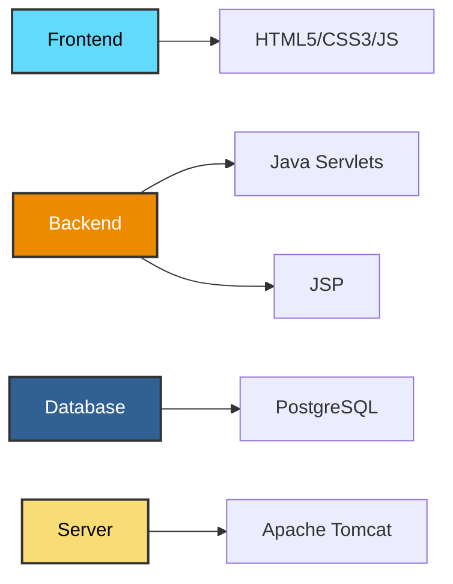
```mermaid
graph LR
    A[Frontend] --> B[HTML5/CSS3/JS]
    C[Backend] --> D[Java Servlets]
    C --> E[JSP]
    F[Database] --> G[PostgreSQL]
    H[Server] --> I[Apache Tomcat]
    
    style A fill:#61DAFB,stroke:#333,stroke-width:2px,color:#000
    style C fill:#ED8B00,stroke:#333,stroke-width:2px,color:#fff
    style F fill:#316192,stroke:#333,stroke-width:2px,color:#fff
    style H fill:#F8DC75,stroke:#333,stroke-width:2px,color:#000
```

</div>

<br/>

<div align="center">

| Category | Technology | Purpose |
|:---|:---:|:---|
| **Frontend** | HTML5, CSS3, JavaScript | User Interface & Interactions |
| **Backend** | Java Servlets, JSP | Business Logic & Views |
| **Database** | PostgreSQL + JDBC | Data Persistence |
| **Server** | Apache Tomcat 9.x | Application Container |
| **Architecture** | MVC, DAO, Singleton | Design Patterns |

</div>

<br/><br/>

<a name="architecture"></a>
<!---------------------------------------------------------------------------->
<!--  ARCHITECTURE                                                           -->
<!---------------------------------------------------------------------------->


<br/>

The full system spans **five layers**: browser client → JSP views → ControllerServlet → DBHelper DAO → PostgreSQL. Every component connects — from user form submissions through session management, into the DAO, and back out to rendered HTML responses.

<br/>

### 🗂️ System Flow

<div align="center">

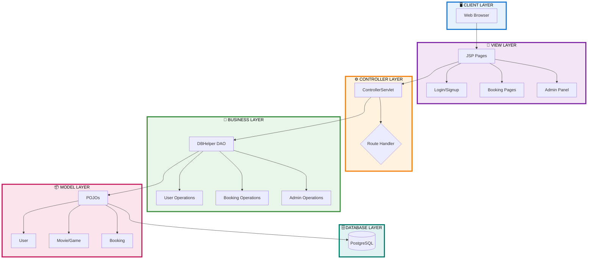
```mermaid
flowchart TD
    subgraph Client["🖥️ CLIENT LAYER"]
        A[Web Browser]
    end
    
    subgraph View["🎨 VIEW LAYER"]
        B[JSP Pages]
        B1[Login/Signup]
        B2[Booking Pages]
        B3[Admin Panel]
        B --> B1 & B2 & B3
    end
    
    subgraph Controller["⚙️ CONTROLLER LAYER"]
        C[ControllerServlet]
        C1{Route Handler}
        C --> C1
    end
    
    subgraph Business["💼 BUSINESS LAYER"]
        D[DBHelper DAO]
        D1[User Operations]
        D2[Booking Operations]
        D3[Admin Operations]
        D --> D1 & D2 & D3
    end
    
    subgraph Model["📦 MODEL LAYER"]
        E[POJOs]
        E1[User]
        E2[Movie/Game]
        E3[Booking]
        E --> E1 & E2 & E3
    end
    
    subgraph Database["🗄️ DATABASE LAYER"]
        F[(PostgreSQL)]
    end
    
    A --> B
    B --> C
    C --> D
    D --> E
    E --> F
    
    style Client fill:#E3F2FD,stroke:#1976D2,stroke-width:4px,color:#000
    style View fill:#F3E5F5,stroke:#7B1FA2,stroke-width:4px,color:#000
    style Controller fill:#FFF3E0,stroke:#F57C00,stroke-width:4px,color:#000
    style Business fill:#E8F5E9,stroke:#388E3C,stroke-width:4px,color:#000
    style Model fill:#FCE4EC,stroke:#C2185B,stroke-width:4px,color:#000
    style Database fill:#E0F2F1,stroke:#00796B,stroke-width:4px,color:#000
```

</div>

<br/>

### ⏱️ Request-Response Cycle

<div align="center">

| Step | From → To | Action |
|:---:|:---|:---|
| 1 | User → JSP Page | Submit form data via browser |
| 2 | JSP Page → ControllerServlet | HTTP POST request dispatched |
| 3 | ControllerServlet → self | Parse `Value` parameter · route action |
| 4 | ControllerServlet → DBHelper | Call appropriate DAO method |
| 5 | DBHelper → PostgreSQL | Execute SQL query · fetch ResultSet |
| 6 | DBHelper → ControllerServlet | Return typed Java object (POJO) |
| 7 | ControllerServlet → JSP | Set session attributes · forward/redirect |
| 8 | JSP → User | Render HTML response |

</div>

<br/>

> **Average Response Time: 100–200 ms**

<br/>

### 🏛️ Architecture Layers

<div align="center">

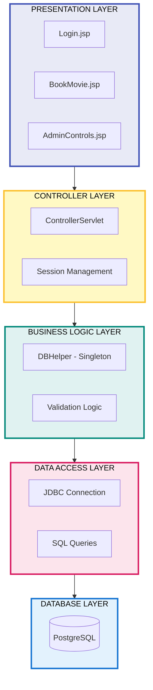
```mermaid
graph TB
    subgraph P["PRESENTATION LAYER"]
        direction LR
        P1[Login.jsp]
        P2[BookMovie.jsp]
        P3[AdminControls.jsp]
    end
    
    subgraph C["CONTROLLER LAYER"]
        direction LR
        C1[ControllerServlet]
        C2[Session Management]
    end
    
    subgraph B["BUSINESS LOGIC LAYER"]
        direction LR
        B1[DBHelper - Singleton]
        B2[Validation Logic]
    end
    
    subgraph D["DATA ACCESS LAYER"]
        direction LR
        D1[JDBC Connection]
        D2[SQL Queries]
    end
    
    subgraph DB["DATABASE LAYER"]
        direction LR
        DB1[(PostgreSQL)]
    end
    
    P --> C
    C --> B
    B --> D
    D --> DB
    
    style P fill:#E8EAF6,stroke:#3F51B5,stroke-width:3px,color:#000
    style C fill:#FFF9C4,stroke:#FBC02D,stroke-width:3px,color:#000
    style B fill:#E0F2F1,stroke:#00897B,stroke-width:3px,color:#000
    style D fill:#FCE4EC,stroke:#D81B60,stroke-width:3px,color:#000
    style DB fill:#E3F2FD,stroke:#1976D2,stroke-width:3px,color:#000
```

</div>

<br/><br/>

<a name="quick-start"></a>
<!---------------------------------------------------------------------------->
<!--  QUICK START                                                            -->
<!---------------------------------------------------------------------------->


<br/>

### ☁️ Prerequisites

<div align="center">

| Requirement | Version | Notes |
|:---|:---:|:---|
| **JDK** | `8+` | Java Development Kit |
| **Apache Tomcat** | `9.x` | Application container |
| **PostgreSQL** | `12+` | Relational database |

</div>

<br/>

### 📥 Installation

<details open>
<summary><b>Step 1 — Clone Repository</b></summary>

<br/>

```bash
git clone https://github.com/kumarpiyushraj/book-my-fun.git
cd book-my-fun
```

<br/>
</details>

<details open>
<summary><b>Step 2 — Database Setup</b></summary>

<br/>

```sql
-- Create database
CREATE DATABASE Entertainment;
\c Entertainment

-- Create tables
CREATE TABLE users (
    username VARCHAR(50) PRIMARY KEY,
    password VARCHAR(100) NOT NULL,
    email VARCHAR(100) UNIQUE NOT NULL,
    age INTEGER CHECK (age >= 0),
    mobile BIGINT CHECK (mobile >= 1000000000 AND mobile <= 9999999999)
);

CREATE TABLE admin (
    adminname VARCHAR(50) PRIMARY KEY,
    apassword VARCHAR(100) NOT NULL
);

CREATE TABLE movie (
    movieid VARCHAR(20) PRIMARY KEY,
    moviename VARCHAR(100) NOT NULL,
    starttime TIME NOT NULL,
    endtime TIME NOT NULL,
    moviedate DATE NOT NULL,
    venue VARCHAR(100),
    ticket_price FLOAT CHECK (ticket_price > 0),
    tickets_available INTEGER CHECK (tickets_available >= 0)
);

CREATE TABLE game (
    gameid VARCHAR(20) PRIMARY KEY,
    gamename VARCHAR(100) NOT NULL,
    starttime TIME NOT NULL,
    endtime TIME NOT NULL,
    gamedate DATE NOT NULL,
    venue VARCHAR(100),
    ticket_price FLOAT CHECK (ticket_price > 0),
    tickets_available INTEGER CHECK (tickets_available >= 0)
);

CREATE TABLE booking (
    bookingid INTEGER PRIMARY KEY,
    username VARCHAR(50) REFERENCES users(username) ON DELETE CASCADE,
    movieid VARCHAR(20) REFERENCES movie(movieid) ON DELETE SET NULL,
    gameid VARCHAR(20) REFERENCES game(gameid) ON DELETE SET NULL,
    bookingdate DATE NOT NULL,
    bookingtime TIME NOT NULL,
    totalpersons INTEGER CHECK (totalpersons > 0),
    ticketprice FLOAT CHECK (ticketprice > 0),
    venue VARCHAR(100)
);

-- Insert default admin
INSERT INTO admin VALUES ('KumarPiyush', 'admin123');
```

<br/>
</details>

<details open>
<summary><b>Step 3 — Configure Application</b></summary>

<br/>

Edit `src/java/dao/DBHelper.java`:

```java
con = DriverManager.getConnection(
    "jdbc:postgresql://localhost:5432/Entertainment",
    "postgres",        // 👈 Your PostgreSQL username
    "your_password"    // 👈 Your PostgreSQL password
);
```

<br/>
</details>

<details open>
<summary><b>Step 4 — Deploy & Run</b></summary>

<br/>

```bash
# Build project (NetBeans/Eclipse)
# OR manually create WAR file
jar -cvf BookMyFun.war .

# Deploy to Tomcat
cp BookMyFun.war $TOMCAT_HOME/webapps/

# Start Tomcat
$TOMCAT_HOME/bin/startup.sh

# Access application
open http://localhost:8080/BookMyFun/Login.jsp
```

<br/>
</details>

<br/>

<a name="default-credentials"></a>

### 🔑 Default Credentials

```plaintext
Admin Login:
├─ Username: KumarPiyush
└─ Password: admin123
```

<br/><br/>

<a name="demo"></a>
<!---------------------------------------------------------------------------->
<!--  DEMO                                                                   -->
<!---------------------------------------------------------------------------->


<br/>

### 🎬 User Journey

---

### 1️⃣ Authentication

<div align="center">

| Login Page | Admin Portal | Registration |
|:---:|:---:|:---:|
|  | 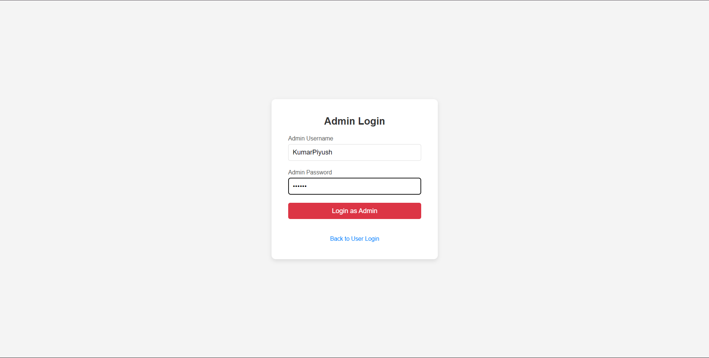 | 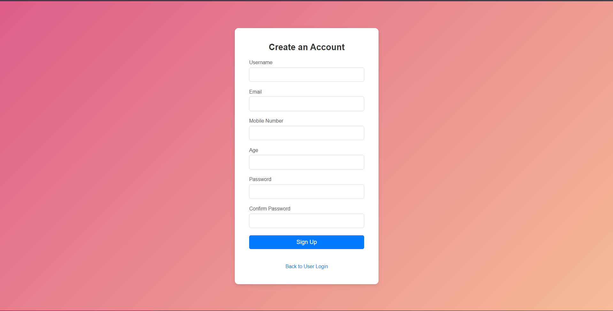 |
| Modern gradient design | Secure admin access | Quick signup form |

</div>

<br/>

---

### 2️⃣ Browse & Select

<div align="center">

<sub>📌 &nbsp;**Entertainment Hub** — Choose between Movies (cinema-themed) and Games (carnival-themed)</sub>

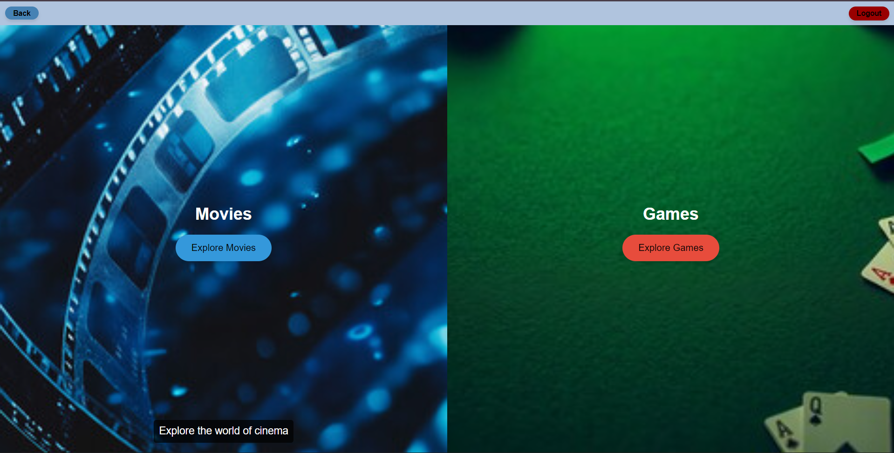

</div>

<br/>

---

### 3️⃣ Booking Flow

<div align="center">

| Movie Listings | Game Events |
|:---:|:---:|
| 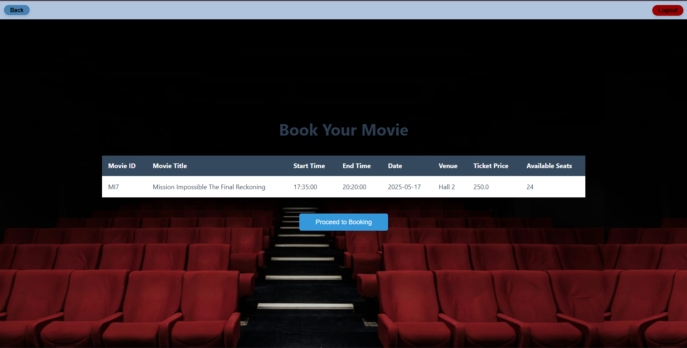 | 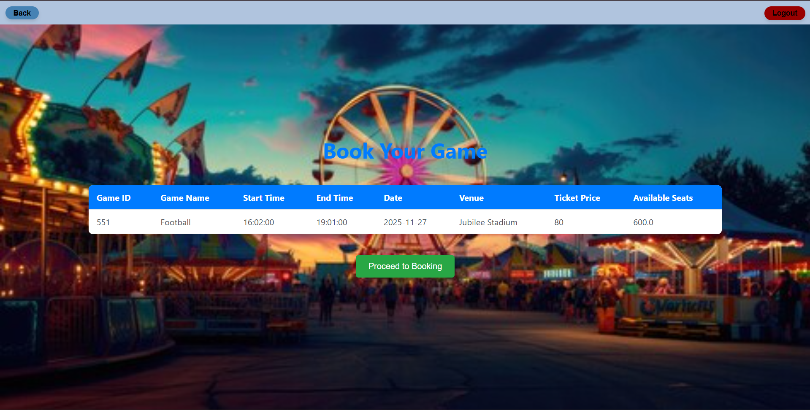 |
| Detailed show information | Live sports & activities |

<br/>

<sub>📌 &nbsp;**Interactive Booking Modal** — Enter event ID and ticket quantity</sub>

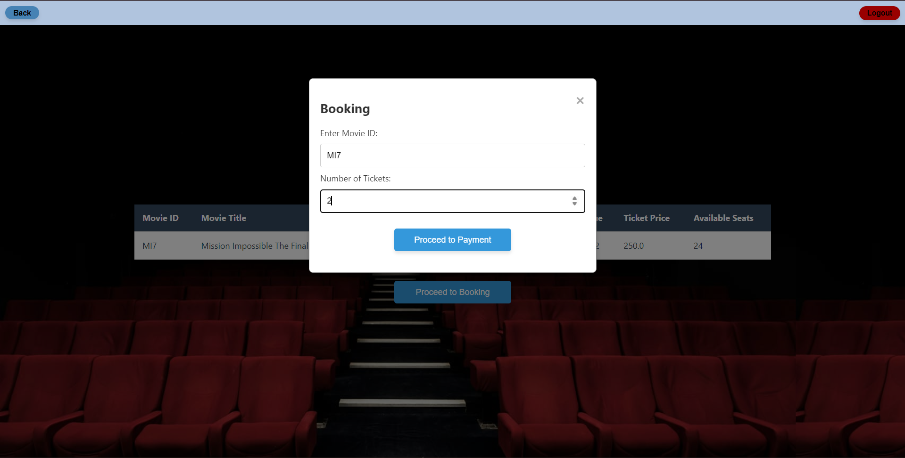

<br/>

| Booking Confirmation | Empty State |
|:---:|:---:|
| 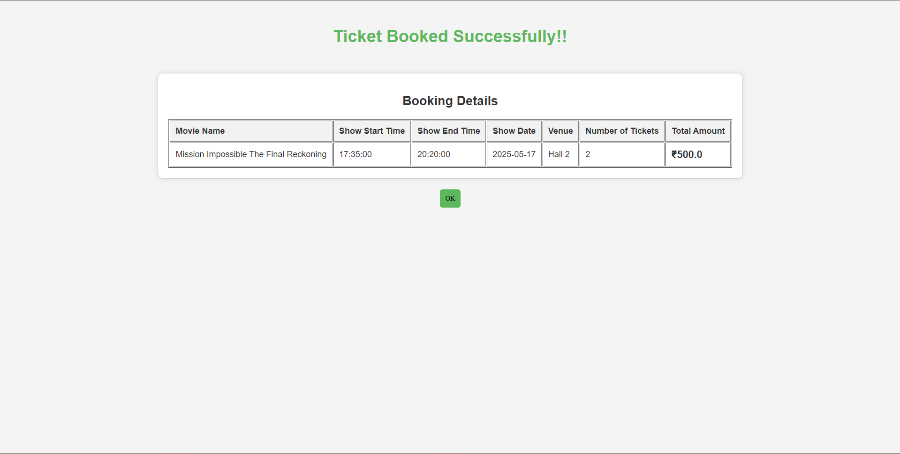 | 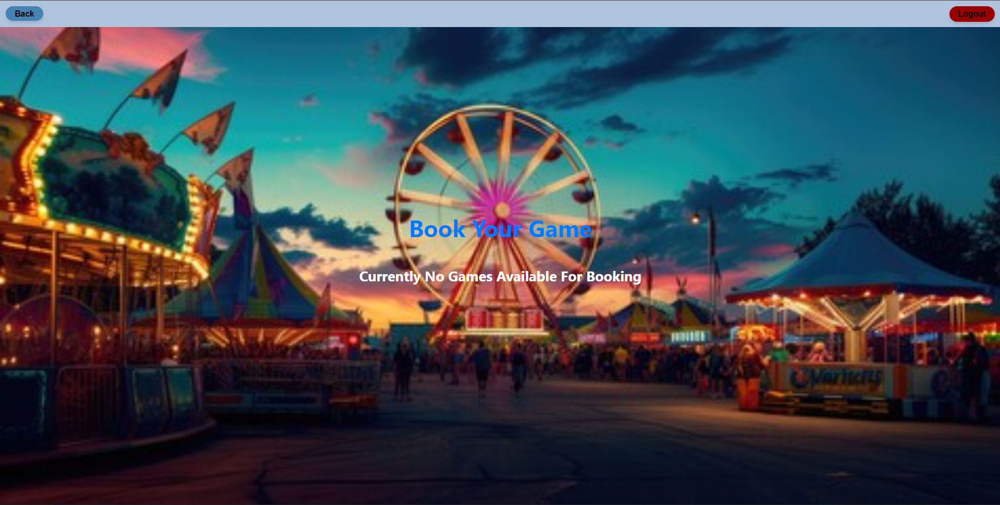 |
| Digital ticket receipt | User-friendly messaging |

</div>

<br/>

---

### 4️⃣ Admin Panel

<div align="center">

| Control Panel | Success Notification |
|:---:|:---:|
| 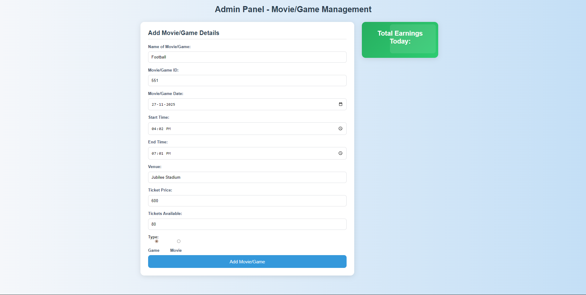 | 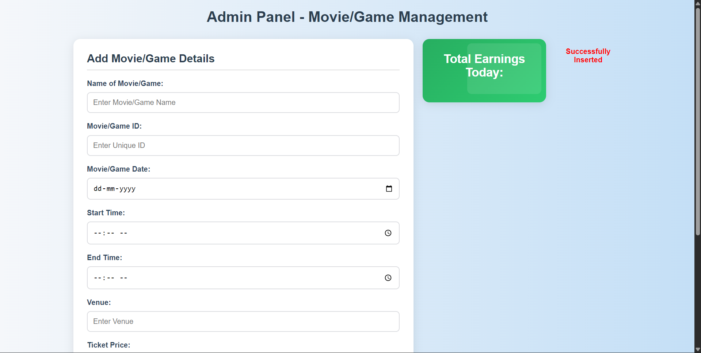 |
| Event management + earnings | Real-time feedback |

</div>

<br/><br/>

<a name="database-schema"></a>
<!---------------------------------------------------------------------------->
<!--  DATABASE SCHEMA                                                        -->
<!---------------------------------------------------------------------------->


<br/>

<div align="center">

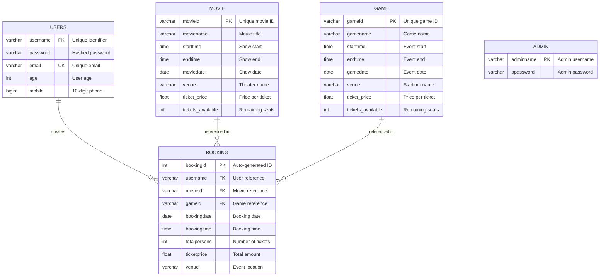
```mermaid
erDiagram
    USERS ||--o{ BOOKING : creates
    MOVIE ||--o{ BOOKING : "referenced in"
    GAME ||--o{ BOOKING : "referenced in"
    
    USERS {
        varchar username PK "Unique identifier"
        varchar password "Hashed password"
        varchar email UK "Unique email"
        int age "User age"
        bigint mobile "10-digit phone"
    }
    
    ADMIN {
        varchar adminname PK "Admin username"
        varchar apassword "Admin password"
    }
    
    MOVIE {
        varchar movieid PK "Unique movie ID"
        varchar moviename "Movie title"
        time starttime "Show start"
        time endtime "Show end"
        date moviedate "Show date"
        varchar venue "Theater name"
        float ticket_price "Price per ticket"
        int tickets_available "Remaining seats"
    }
    
    GAME {
        varchar gameid PK "Unique game ID"
        varchar gamename "Game name"
        time starttime "Event start"
        time endtime "Event end"
        date gamedate "Event date"
        varchar venue "Stadium name"
        float ticket_price "Price per ticket"
        int tickets_available "Remaining seats"
    }
    
    BOOKING {
        int bookingid PK "Auto-generated ID"
        varchar username FK "User reference"
        varchar movieid FK "Movie reference"
        varchar gameid FK "Game reference"
        date bookingdate "Booking date"
        time bookingtime "Booking time"
        int totalpersons "Number of tickets"
        float ticketprice "Total amount"
        varchar venue "Event location"
    }
```

</div>

<br/>

### 🔗 Relationships

<div align="center">

| Relationship | Description |
|:---|:---|
| 📌 **One User → Many Bookings** | A single user can create multiple bookings |
| 📌 **One Movie → Many Bookings** | A movie can be booked by multiple users |
| 📌 **One Game → Many Bookings** | A game event can be booked by multiple users |
| 📌 **One Booking → One Movie OR One Game** | Each booking references either a movie or game (nullable) |

</div>

<br/><br/>

<a name="project-structure"></a>
<!---------------------------------------------------------------------------->
<!--  PROJECT STRUCTURE                                                      -->
<!---------------------------------------------------------------------------->


<br/>

```
book-my-fun/
│
├── 📂 src/java/
│   ├── 📂 controller/
│   │   └── 📄 ControllerServlet.java      # Request routing & session management
│   │
│   ├── 📂 dao/
│   │   └── 📄 DBHelper.java                # Database operations (Singleton)
│   │
│   └── 📂 pojo/
│       ├── 📄 User.java                    # User entity
│       ├── 📄 Admin.java                   # Admin entity
│       ├── 📄 Movie.java                   # Movie entity
│       ├── 📄 Game.java                    # Game entity
│       └── 📄 Booking.java                 # Booking entity
│
├── 📂 web/
│   ├── 📄 Login.jsp                        # User login interface
│   ├── 📄 AdminLogin.jsp                   # Admin login interface
│   ├── 📄 UserSignUp.jsp                   # User registration form
│   ├── 📄 UserSelectionPage.jsp            # Movie/Game selection hub
│   ├── 📄 BookMovie.jsp                    # Movie booking page
│   ├── 📄 BookGames.jsp                    # Game booking page
│   ├── 📄 BookingTicket.jsp                # Confirmation receipt
│   ├── 📄 AdminControls.jsp                # Admin dashboard
│   ├── 📄 header.jsp                       # Reusable header component
│   │
│   └── 📂 images/                          # UI screenshots
│       ├── 🖼️ 1234.jpg
│       ├── 🖼️ AdminLogin.png
│       ├── 🖼️ UserSignUp.png
│       └── ...
│
└── 📄 README.md
```

<br/><br/>

<a name="api-reference"></a>
<!---------------------------------------------------------------------------->
<!--  API REFERENCE                                                          -->
<!---------------------------------------------------------------------------->


<br/>

All requests route through `ControllerServlet` using the `Value` parameter.

<br/>

<div align="center">

| Value Parameter | Method | Purpose | Response |
|:---|:---:|:---|:---|
| `UserLogin` | POST | User authentication | → UserSelectionPage.jsp |
| `UserSignup` | POST | Register new user | → Login.jsp |
| `BookMovie` | POST | Create movie booking | → BookingTicket.jsp |
| `BookGame` | POST | Create game booking | → BookingTicket.jsp |
| `AdminLogin` | POST | Admin authentication | → AdminControls.jsp |
| `AdminControls` | POST | Add movie/game event | → AdminControls.jsp |
| `LogoutUser` | POST | End user session | → Login.jsp |

</div>

<br/>

### 💡 Example Request

```html
<form action="ControllerServlet" method="POST">
    <input type="hidden" name="Value" value="BookMovie">
    <input type="text" name="movieId" required>
    <input type="number" name="Movietickets" min="1" required>
    <button type="submit">Book Now</button>
</form>
```

<br/><br/>

<a name="roadmap"></a>
<!---------------------------------------------------------------------------->
<!--  ROADMAP                                                                -->
<!---------------------------------------------------------------------------->


<br/>

<div align="center">

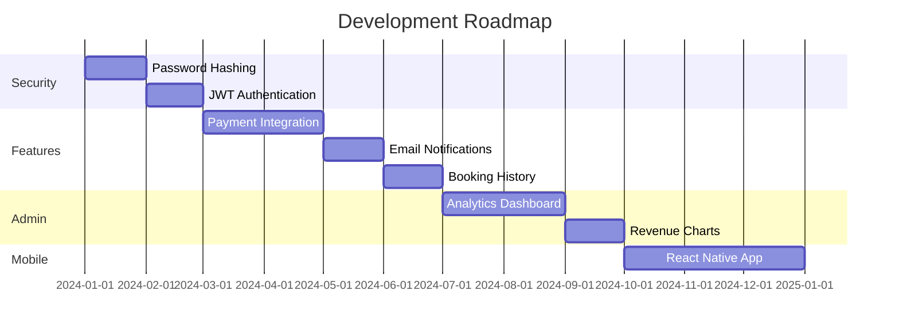
```mermaid
gantt
    title Development Roadmap
    dateFormat  YYYY-MM
    section Security
    Password Hashing           :2024-01, 1M
    JWT Authentication         :2024-02, 1M
    section Features
    Payment Integration        :2024-03, 2M
    Email Notifications        :2024-05, 1M
    Booking History           :2024-06, 1M
    section Admin
    Analytics Dashboard       :2024-07, 2M
    Revenue Charts           :2024-09, 1M
    section Mobile
    React Native App         :2024-10, 3M
```

</div>

<br/>

<div align="center">

| 🔐 Security | ✨ Features | 📊 Admin Tools | 📱 Platform |
|:---|:---|:---|:---|
| ✅ Session management | ✅ Booking system | ✅ Event management | ✅ Web application |
| ⬜ Password encryption | ⬜ Payment gateway | ✅ Earnings tracker | ⬜ Mobile app |
| ⬜ JWT tokens | ⬜ Email/SMS alerts | ⬜ Analytics dashboard | ⬜ PWA support |
| ⬜ 2FA authentication | ⬜ User profiles | ⬜ Export reports | ⬜ API services |
| ⬜ CAPTCHA integration | ⬜ Reviews & ratings | ⬜ Inventory alerts | ⬜ Microservices |

</div>

<br/><br/>

<a name="contributing"></a>
<!---------------------------------------------------------------------------->
<!--  CONTRIBUTING                                                           -->
<!---------------------------------------------------------------------------->


<br/>

We welcome contributions! Here's the recommended workflow:

<br/>

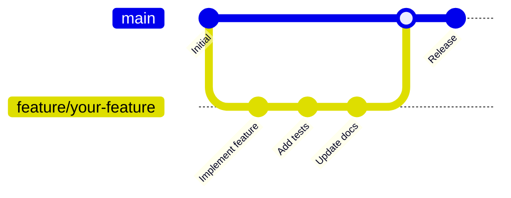
```mermaid
gitGraph
    commit id: "Initial"
    branch feature/your-feature
    checkout feature/your-feature
    commit id: "Implement feature"
    commit id: "Add tests"
    commit id: "Update docs"
    checkout main
    merge feature/your-feature
    commit id: "Release"
```

<br/>

<div align="center">

| Step | Action |
|:---:|:---|
| 1 | **Fork** the repository |
| 2 | **Create** a feature branch — `git checkout -b feature/AmazingFeature` |
| 3 | **Commit** your changes — `git commit -m 'Add AmazingFeature'` |
| 4 | **Push** to branch — `git push origin feature/AmazingFeature` |
| 5 | **Open** a Pull Request |

</div>

<br/>

### 🐛 Report Issues

Found a bug? [Open an issue](https://github.com/kumarpiyushraj/book-my-fun/issues/new) with a clear description, steps to reproduce, expected vs actual behavior, and screenshots if applicable.

<br/><br/>

<div align="center">

**Need Help or Have Questions?**

<br/>

[](https://github.com/kumarpiyushraj/book-my-fun/issues)&nbsp;
[](https://github.com/kumarpiyushraj/book-my-fun)&nbsp;
[](mailto:kmpiyushraj@gmail.com)

</div>

<br/><br/>

<!---------------------------------------------------------------------------->
<!--  FOOTER                                                                 -->
<!---------------------------------------------------------------------------->

<div align="center">

**Built with ❤️ and ☕ &nbsp;·&nbsp; Java EE &nbsp;·&nbsp; Apache Tomcat 9 &nbsp;·&nbsp; PostgreSQL**

<br/>

[](https://github.com/kumarpiyushraj/book-my-fun/stargazers)

<br/>

*© 2024 Kumar Piyush Raj &nbsp;·&nbsp; [GitHub @kumarpiyushraj](https://github.com/kumarpiyushraj)*


</div>
