# 🎬🎮 Book My Fun

<div align="center">


**A modern, full-stack entertainment booking platform built with Java EE**

[](https://www.java.com/)
[](https://www.postgresql.org/)
[](https://javaee.github.io/servlet-spec/)

</div>

---

## 🌟 Overview

Book My Fun is a comprehensive entertainment booking system that streamlines ticket reservations for movies and games. Built with enterprise-grade Java technologies, it offers a seamless experience for both end-users and administrators.

<table>
<tr>
<td width="50%">

### 👤 For Users
- Browse movies & games
- Real-time seat availability
- Instant booking confirmation
- Digital ticket receipts

</td>
<td width="50%">

### 👨‍💼 For Admins
- Event management dashboard
- Live earnings tracking
- Inventory control
- Analytics & reporting

</td>
</tr>
</table>

---

## ✨ Key Features

<div align="center">

| 🎬 Movies | 🎮 Games | 💳 Booking | 📊 Admin |
|:---:|:---:|:---:|:---:|
| Browse catalog | Event listings | Instant confirmation | Dashboard |
| Show timings | Venue details | Seat selection | Revenue tracking |
| Price info | Availability | Receipt generation | Event management |

</div>

---

## 🛠️ Tech Stack

<div align="center">


</div>

<table align="center">
<tr>
<th>Category</th>
<th>Technology</th>
<th>Purpose</th>
</tr>
<tr>
<td><b>Frontend</b></td>
<td>HTML5, CSS3, JavaScript</td>
<td>User Interface & Interactions</td>
</tr>
<tr>
<td><b>Backend</b></td>
<td>Java Servlets, JSP</td>
<td>Business Logic & Views</td>
</tr>
<tr>
<td><b>Database</b></td>
<td>PostgreSQL + JDBC</td>
<td>Data Persistence</td>
</tr>
<tr>
<td><b>Server</b></td>
<td>Apache Tomcat 9.x</td>
<td>Application Container</td>
</tr>
<tr>
<td><b>Architecture</b></td>
<td>MVC, DAO, Singleton</td>
<td>Design Patterns</td>
</tr>
</table>

---

## 🏛️ Architecture

<div align="center">

### System Flow


### Request-Response Cycle

```mermaid
sequenceDiagram
    autonumber
    actor User
    participant JSP as 📄 JSP
    participant Servlet as ⚙️ Servlet
    participant DAO as 💼 DBHelper
    participant DB as 🗄️ Database
    
    User->>JSP: Submit Form
    JSP->>Servlet: HTTP POST Request
    Servlet->>Servlet: Parse Parameters
    Servlet->>DAO: Call Business Method
    DAO->>DB: Execute SQL Query
    DB-->>DAO: Return ResultSet
    DAO-->>Servlet: Return Java Object
    Servlet->>Servlet: Set Session Attributes
    Servlet->>JSP: Forward/Redirect
    JSP-->>User: Render Response
    
    Note over User,DB: Complete request cycle in ~100-200ms
```



</div>

---

## 🚀 Quick Start

<div align="center">

### Prerequisites


</div>

### 📥 Installation

<details open>
<summary><b>Step 1: Clone Repository</b></summary>

```bash
git clone https://github.com/kumarpiyushraj/book-my-fun.git
cd book-my-fun
```

</details>

<details open>
<summary><b>Step 2: Database Setup</b></summary>

```sql
-- Create database
CREATE DATABASE Entertainment;
\c Entertainment

-- Create tables
CREATE TABLE users (
    username VARCHAR(50) PRIMARY KEY,
    password VARCHAR(100) NOT NULL,
    email VARCHAR(100) UNIQUE NOT NULL,
    age INTEGER CHECK (age >= 0),
    mobile BIGINT CHECK (mobile >= 1000000000 AND mobile <= 9999999999)
);

CREATE TABLE admin (
    adminname VARCHAR(50) PRIMARY KEY,
    apassword VARCHAR(100) NOT NULL
);

CREATE TABLE movie (
    movieid VARCHAR(20) PRIMARY KEY,
    moviename VARCHAR(100) NOT NULL,
    starttime TIME NOT NULL,
    endtime TIME NOT NULL,
    moviedate DATE NOT NULL,
    venue VARCHAR(100),
    ticket_price FLOAT CHECK (ticket_price > 0),
    tickets_available INTEGER CHECK (tickets_available >= 0)
);

CREATE TABLE game (
    gameid VARCHAR(20) PRIMARY KEY,
    gamename VARCHAR(100) NOT NULL,
    starttime TIME NOT NULL,
    endtime TIME NOT NULL,
    gamedate DATE NOT NULL,
    venue VARCHAR(100),
    ticket_price FLOAT CHECK (ticket_price > 0),
    tickets_available INTEGER CHECK (tickets_available >= 0)
);

CREATE TABLE booking (
    bookingid INTEGER PRIMARY KEY,
    username VARCHAR(50) REFERENCES users(username) ON DELETE CASCADE,
    movieid VARCHAR(20) REFERENCES movie(movieid) ON DELETE SET NULL,
    gameid VARCHAR(20) REFERENCES game(gameid) ON DELETE SET NULL,
    bookingdate DATE NOT NULL,
    bookingtime TIME NOT NULL,
    totalpersons INTEGER CHECK (totalpersons > 0),
    ticketprice FLOAT CHECK (ticketprice > 0),
    venue VARCHAR(100)
);

-- Insert default admin
INSERT INTO admin VALUES ('KumarPiyush', 'admin123');
```

</details>

<details open>
<summary><b>Step 3: Configure Application</b></summary>

Edit `src/java/dao/DBHelper.java`:

```java
con = DriverManager.getConnection(
    "jdbc:postgresql://localhost:5432/Entertainment",
    "postgres",        // 👈 Your PostgreSQL username
    "your_password"    // 👈 Your PostgreSQL password
);
```

</details>

<details open>
<summary><b>Step 4: Deploy & Run</b></summary>

```bash
# Build project (NetBeans/Eclipse)
# OR manually create WAR file
jar -cvf BookMyFun.war .

# Deploy to Tomcat
cp BookMyFun.war $TOMCAT_HOME/webapps/

# Start Tomcat
$TOMCAT_HOME/bin/startup.sh

# Access application
open http://localhost:8080/BookMyFun/Login.jsp
```

</details>

### 🔑 Default Credentials

```plaintext
Admin Login:
├─ Username: KumarPiyush
└─ Password: admin123
```

---

## 💻 Demo

### 🎬 User Journey

<div align="center">

#### 1️⃣ Authentication

<table>
<tr>
<td width="33%">

<p align="center"><b>Login Page</b><br/>Modern gradient design</p>
</td>
<td width="33%">

<p align="center"><b>Admin Portal</b><br/>Secure admin access</p>
</td>
<td width="33%">

<p align="center"><b>Registration</b><br/>Quick signup form</p>
</td>
</tr>
</table>

#### 2️⃣ Browse & Select


<p><b>Entertainment Hub</b> - Choose between Movies (cinema-themed) and Games (carnival-themed)</p>

#### 3️⃣ Booking Flow

<table>
<tr>
<td width="50%">

<p align="center"><b>Movie Listings</b><br/>Detailed show information</p>
</td>
<td width="50%">

<p align="center"><b>Game Events</b><br/>Live sports & activities</p>
</td>
</tr>
</table>


<p><b>Interactive Booking Modal</b> - Enter event ID and ticket quantity</p>

<table>
<tr>
<td width="50%">

<p align="center"><b>Booking Confirmation</b><br/>Digital ticket receipt</p>
</td>
<td width="50%">

<p align="center"><b>Empty State</b><br/>User-friendly messaging</p>
</td>
</tr>
</table>

#### 4️⃣ Admin Panel

<table>
<tr>
<td width="50%">

<p align="center"><b>Control Panel</b><br/>Event management + earnings</p>
</td>
<td width="50%">

<p align="center"><b>Success Notification</b><br/>Real-time feedback</p>
</td>
</tr>
</table>

</div>

---

## 📊 Database Schema

<div align="center">


### 🔗 Relationships

```
📌 One User → Many Bookings
📌 One Movie → Many Bookings  
📌 One Game → Many Bookings
📌 One Booking → One Movie OR One Game (nullable)
```

</div>

---

## 📁 Project Structure

```
book-my-fun/
│
├── 📂 src/java/
│   ├── 📂 controller/
│   │   └── 📄 ControllerServlet.java      # Request routing & session management
│   │
│   ├── 📂 dao/
│   │   └── 📄 DBHelper.java                # Database operations (Singleton)
│   │
│   └── 📂 pojo/
│       ├── 📄 User.java                    # User entity
│       ├── 📄 Admin.java                   # Admin entity
│       ├── 📄 Movie.java                   # Movie entity
│       ├── 📄 Game.java                    # Game entity
│       └── 📄 Booking.java                 # Booking entity
│
├── 📂 web/
│   ├── 📄 Login.jsp                        # User login interface
│   ├── 📄 AdminLogin.jsp                   # Admin login interface
│   ├── 📄 UserSignUp.jsp                   # User registration form
│   ├── 📄 UserSelectionPage.jsp            # Movie/Game selection hub
│   ├── 📄 BookMovie.jsp                    # Movie booking page
│   ├── 📄 BookGames.jsp                    # Game booking page
│   ├── 📄 BookingTicket.jsp                # Confirmation receipt
│   ├── 📄 AdminControls.jsp                # Admin dashboard
│   ├── 📄 header.jsp                       # Reusable header component
│   │
│   └── 📂 images/                          # UI screenshots
│       ├── 🖼️ 1234.jpg
│       ├── 🖼️ AdminLogin.png
│       ├── 🖼️ UserSignUp.png
│       └── ...
│
└── 📄 README.md
```

---

## 🔌 API Reference

<div align="center">

### Servlet Endpoints

All requests route through `ControllerServlet` with `Value` parameter

<table>
<tr>
<th>Value Parameter</th>
<th>Method</th>
<th>Purpose</th>
<th>Response</th>
</tr>
<tr>
<td><code>UserLogin</code></td>
<td>POST</td>
<td>User authentication</td>
<td>→ UserSelectionPage.jsp</td>
</tr>
<tr>
<td><code>UserSignup</code></td>
<td>POST</td>
<td>Register new user</td>
<td>→ Login.jsp</td>
</tr>
<tr>
<td><code>BookMovie</code></td>
<td>POST</td>
<td>Create movie booking</td>
<td>→ BookingTicket.jsp</td>
</tr>
<tr>
<td><code>BookGame</code></td>
<td>POST</td>
<td>Create game booking</td>
<td>→ BookingTicket.jsp</td>
</tr>
<tr>
<td><code>AdminLogin</code></td>
<td>POST</td>
<td>Admin authentication</td>
<td>→ AdminControls.jsp</td>
</tr>
<tr>
<td><code>AdminControls</code></td>
<td>POST</td>
<td>Add movie/game event</td>
<td>→ AdminControls.jsp</td>
</tr>
<tr>
<td><code>LogoutUser</code></td>
<td>POST</td>
<td>End user session</td>
<td>→ Login.jsp</td>
</tr>
</table>

### Example Request

```html
<form action="ControllerServlet" method="POST">
    <input type="hidden" name="Value" value="BookMovie">
    <input type="text" name="movieId" required>
    <input type="number" name="Movietickets" min="1" required>
    <button type="submit">Book Now</button>
</form>
```

</div>

---

## 🎯 Roadmap

<div align="center">


</div>

<table>
<tr>
<td width="50%">

### 🔐 Security
- [x] Session management
- [ ] Password encryption
- [ ] JWT tokens
- [ ] 2FA authentication
- [ ] CAPTCHA integration

</td>
<td width="50%">

### ✨ Features
- [x] Booking system
- [ ] Payment gateway
- [ ] Email/SMS alerts
- [ ] User profiles
- [ ] Reviews & ratings

</td>
</tr>
<tr>
<td width="50%">

### 📊 Admin Tools
- [x] Event management
- [x] Earnings tracker
- [ ] Analytics dashboard
- [ ] Export reports
- [ ] Inventory alerts

</td>
<td width="50%">

### 📱 Platform
- [x] Web application
- [ ] Mobile app
- [ ] PWA support
- [ ] API services
- [ ] Microservices

</td>
</tr>
</table>

---

## 🤝 Contributing

<div align="center">

We welcome contributions! Here's how you can help:

[](https://github.com/kumarpiyushraj/book-my-fun/fork)

</div>

### 📝 Contribution Guidelines


1. **Fork** the repository
2. **Create** a feature branch (`git checkout -b feature/AmazingFeature`)
3. **Commit** your changes (`git commit -m 'Add AmazingFeature'`)
4. **Push** to branch (`git push origin feature/AmazingFeature`)
5. **Open** a Pull Request

### 🐛 Report Issues

Found a bug? [Open an issue](https://github.com/kumarpiyushraj/book-my-fun/issues/new) with:
- Clear description
- Steps to reproduce
- Expected vs actual behavior
- Screenshots (if applicable)

---

## 📄 License

<div align="center">

```
MIT License

Copyright (c) 2024 Book My Fun

Permission is hereby granted, free of charge, to any person obtaining a copy
of this software and associated documentation files (the "Software"), to deal
in the Software without restriction, including without limitation the rights
to use, copy, modify, merge, publish, distribute, sublicense, and/or sell
copies of the Software, subject to the following conditions:

The above copyright notice and this permission notice shall be included in all
copies or substantial portions of the Software.
```

[](https://opensource.org/licenses/MIT)

</div>

---

## 👨‍💻 Author

<div align="center">


### Kumar Piyush

[](https://github.com/kumarpiyushraj)
[](mailto:kmpiyushraj@gmail.com)

</div>

---

## 🙏 Acknowledgments

<div align="center">

Special thanks to:

- **Java EE Community** - For comprehensive documentation
- **PostgreSQL Team** - For robust database system
- **Apache Tomcat** - For reliable servlet container
- **Stack Overflow** - For community support

</div>

---

<div align="center">

### ⭐ Star History

[](https://star-history.com/#kumarpiyushraj/book-my-fun&Date)

---

### 📊 Repository Stats


---

### 🌟 Show Your Support

If you found this project helpful, please consider giving it a ⭐!

[](https://github.com/yourusername/book-my-fun/stargazers)
[](https://github.com/yourusername/book-my-fun/network/members)
[](https://github.com/yourusername/book-my-fun/watchers)

---

**Made with ❤️ and ☕ using Java EE**

[Back to Top](#-book-my-fun)

</div>
